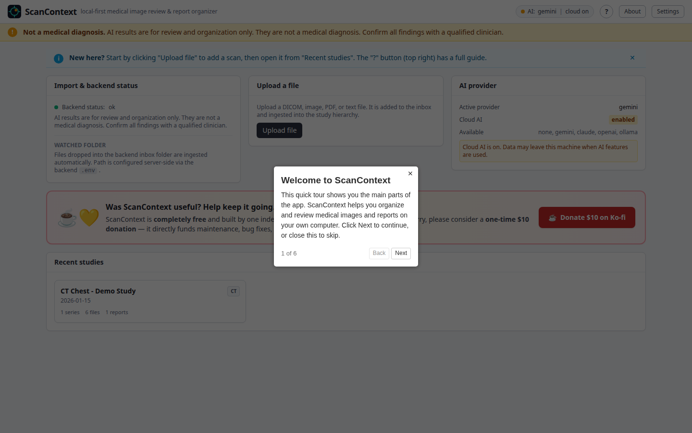
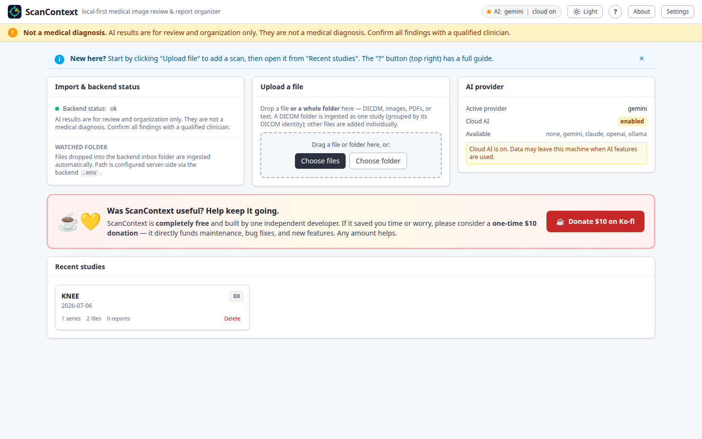
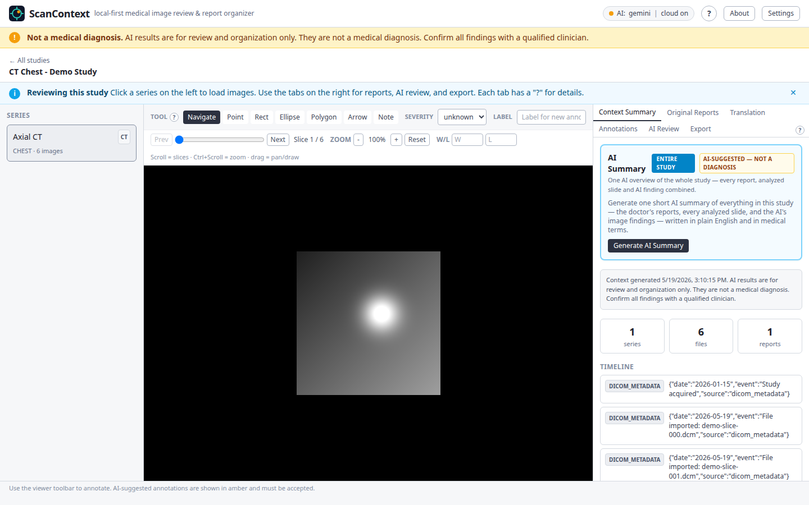
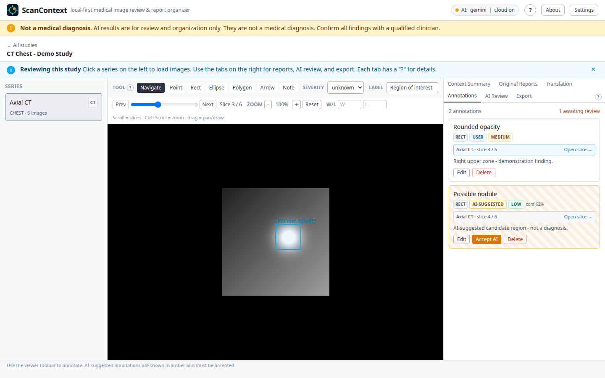
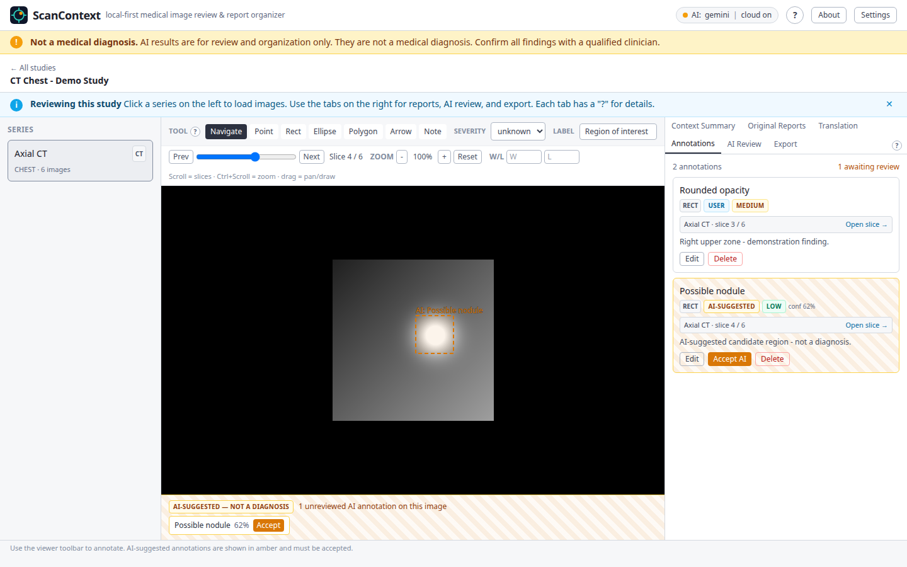
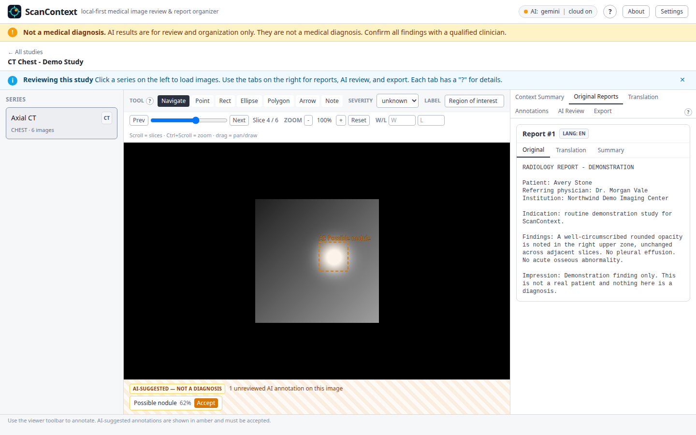
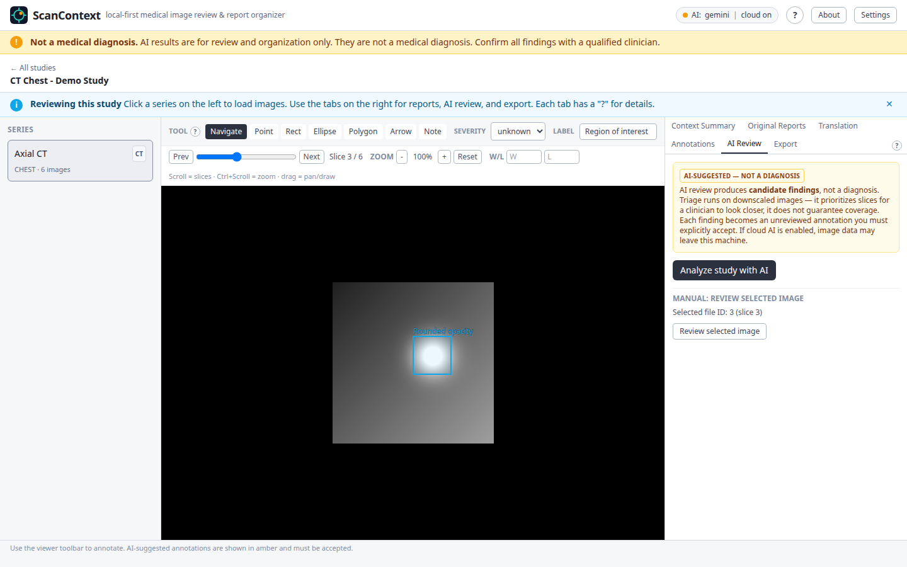
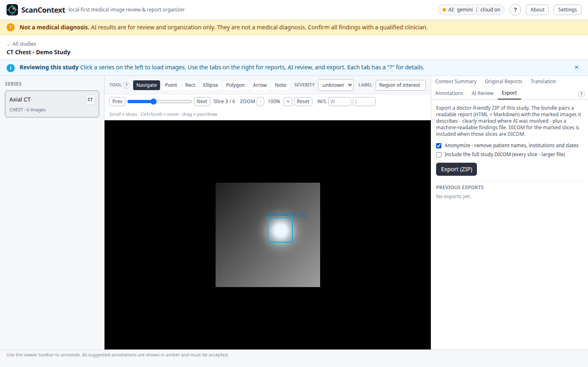
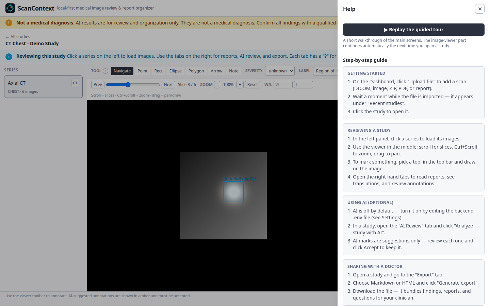

# ScanContext

**Local-first medical image viewer, report organizer, and AI-assisted
annotation tool.** Runs entirely on your own computer — Windows, macOS, or
Linux.

> ⚠️ **Not a medical device. Not a diagnosis.**
> ScanContext helps you organize, view, and understand medical imaging and
> reports, and prepare questions for your doctor. It does **not** diagnose any
> condition. Every result — especially anything AI-suggested — must be
> confirmed by a qualified clinician.

**Quick links:**
[⬇️ Download](https://github.com/nikolareljin/scancontext/releases/latest) ·
[🎬 See it in action](#-see-scancontext-in-action) ·
[🐳 Docker Desktop](https://www.docker.com/products/docker-desktop/) ·
[🐞 Report a problem](https://github.com/nikolareljin/scancontext/issues) ·
[☕ Donate](https://ko-fi.com/nikolareljin)

---

## ⬇️ Download & install

No GitHub account and no source code needed — and on Windows and macOS, no
terminal either. On Linux the bundle uses a short `sh ./start.sh` command, or
install the `.deb` / `.rpm` launcher for a click-only setup.

There are **two ways to run ScanContext** — pick whichever you prefer. Both
need Docker Desktop, so do Step 1 either way.

### Step 1 — Install Docker Desktop (free, one time)

ScanContext runs inside Docker. Install Docker Desktop for your system:

**<https://www.docker.com/products/docker-desktop/>**

- Windows: <https://docs.docker.com/desktop/install/windows-install/>
- macOS: <https://docs.docker.com/desktop/install/mac-install/>
- Linux: <https://docs.docker.com/desktop/install/linux/>

After installing, **open Docker Desktop once** and wait until it says
**"running"**. You only ever do this once.

### Step 2 — Choose how to run ScanContext

All downloads are on the **[Releases page](https://github.com/nikolareljin/scancontext/releases/latest)**.

#### Option A — The ScanContext app (recommended, easiest)

A small desktop app that starts and stops ScanContext for you with one click —
no scripts, no files to manage. Download the installer for your system:

| System  | Download | Install |
|---------|----------|---------|
| Windows | `ScanContext_<version>_x64-setup.exe` | Double-click, follow the installer |
| macOS   | `ScanContext_<version>_<arch>.dmg` | Open the `.dmg`, drag **ScanContext** to Applications |
| Linux   | `ScanContext_<version>_amd64.AppImage` | `chmod +x` the file, then double-click — or install the `.deb` / `.rpm` |

Then open **ScanContext** like any other app. It checks Docker, downloads the
app on first run, and starts it. When it is ready, click **Open ScanContext**
to launch it in your browser. Use the window — or the tray / menu-bar icon —
to **Start**, **Stop**, and **Open** ScanContext any time.

> **First launch — unsigned app warning.** These installers are not yet
> code-signed, so your system may warn you the first time:
> - **macOS:** right-click the app → **Open** → **Open**. (Or System Settings →
>   Privacy & Security → **Open Anyway**.)
> - **Windows:** on the blue SmartScreen prompt, click **More info** →
>   **Run anyway**.
>
> You only need to do this once.

#### Option B — Install via winget (Windows, no SmartScreen warning)

If you have Windows Package Manager (`winget`), open PowerShell or Windows Terminal and run:

```powershell
winget install NikolaReljin.ScanContext
```

Installs through Microsoft's trusted channel — no SmartScreen warning, no manual download.

#### Option C — The download bundle (`.zip`)

If you would rather not install an app, download the bundle and double-click a
start file:

1. Download `ScanContext-<version>.zip` from the
   [Releases page](https://github.com/nikolareljin/scancontext/releases/latest)
   and unzip it anywhere (Desktop, Documents…).
2. Open the unzipped folder and start it:

   | System  | Do this |
   |---------|---------|
   | Windows | Double-click **`Start ScanContext.bat`** |
   | macOS   | Double-click **`Start ScanContext.command`** |
   | Linux   | Run `sh ./start.sh` in the folder |

The first start downloads the app (a few minutes). When it is ready your
browser opens **ScanContext**, and a short guided tour begins. Reopen help any
time with the **"?"** button.

### Stopping it

- **App (Option A):** click **Stop** in the window or the tray / menu-bar icon.
- **Bundle (Option B):** double-click **`Stop ScanContext.bat`** (Windows) or
  run `sh ./stop.sh` (macOS / Linux).

Your studies and data are always kept between runs.

---

## System requirements

- **Windows 10/11**, **macOS 12+**, or a modern **Linux** desktop.
- **Docker Desktop** installed and running.
- ~4 GB free disk space for the app images, plus room for your studies.
- A modern browser (Chrome, Edge, Firefox, or Safari).

---

## What it does

- Import DICOM studies, images, ZIPs, PDFs, and text reports.
- View images and DICOM in a web viewer; draw and save annotations.
- Extract and (optionally) translate non-English reports to English.
- Optionally use AI to summarize reports and suggest regions to review —
  clearly labeled "candidate findings, not a diagnosis".
- Export a doctor-friendly summary to share at an appointment.

**Your data stays on your machine.** Nothing is uploaded anywhere unless you
explicitly turn on a cloud AI provider in Settings. AI is **off by default**.

---

## 🎬 See ScanContext in action

Everything below is a real walkthrough of ScanContext, captured from the
built-in **demo study** — a fully fictional CT chest scan with invented
patient details. No real medical data is shown anywhere.

▶️ **[Watch the full walkthrough (~60 seconds)](docs/showcase/video/walkthrough.webm)**

### First run — a guided tour

New users get a short guided tour the first time they open ScanContext.



### Your studies at a glance

The dashboard lists every study you have imported, with import status and the
active AI provider.



### Review images

Open a study to scroll through slices, zoom, and adjust window/level in the
built-in viewer.



### Annotate findings

Mark regions yourself, or accept AI-suggested candidate regions. Confirmed
marks show solid blue; AI suggestions awaiting your review show dotted amber.





### Read and translate reports

Imported reports are shown exactly as received, with optional English
translation and an AI summary.



### Optional AI review

Turn on an AI provider and let ScanContext analyze a study — it picks the most
relevant slices and suggests regions worth a closer look, always labeled
"candidate findings, not a diagnosis".



### Export to share with a doctor

Export a study as a doctor-friendly ZIP — a readable report plus the marked
images. Tick **Anonymize** to strip patient names, institutions, and dates
before the file leaves your machine.



### Help, any time

A built-in Help drawer has guides, an FAQ, a safety summary, and a button to
replay the guided tour.



> The complete screenshot set is in
> [`docs/showcase/screenshots/`](docs/showcase/screenshots/).

---

## Optional — connect an AI provider

AI is **off by default** and entirely optional — ScanContext works fully
without it. When you turn it on, it can summarize reports, translate
non-English reports, and suggest regions of an image worth a closer look —
always labeled "candidate findings, not a diagnosis".

You can use any one of these providers:

| Provider | Get a key / install | Notes |
|----------|---------------------|-------|
| **Google Gemini** | <https://aistudio.google.com/apikey> | Recommended — free tier to try, paid tier for real use |
| Anthropic Claude | <https://console.anthropic.com/settings/keys> | Paid API |
| OpenAI | <https://platform.openai.com/api-keys> | Paid API |
| Ollama | <https://ollama.com/download> | Fully local — no key, nothing leaves your computer |

When a cloud provider is enabled, image/report data **for the study you
choose** may be sent to that provider — ScanContext strips patient identifiers
first. Ollama keeps everything on your machine.

### Setting up Google Gemini (recommended)

**1. Get an API key.** Open <https://aistudio.google.com/apikey>, sign in with
a Google account, click **Create API key**, and copy it (it looks like
`AIza…`). Keep it private — treat it like a password.

**2. Turn on billing — important for medical privacy.** A new key starts on the
free tier. Open the key's Google Cloud project and enable billing (the **paid
tier**):

> ⚠️ **Anonymization only protects you on the paid tier.** ScanContext strips
> patient identifiers before sending anything to Gemini — but on the **free
> tier, Google may still use your (anonymized) images and reports to improve
> its models**. Only the **paid tier** stops that. The anonymization step does
> not give you real privacy on the free tier — for actual medical data, use the
> paid tier.

- The most thorough model (`gemini-2.5-pro`) and reliable speed need the paid
  tier.
- You can set a **budget cap** in Google Cloud so there are no surprises.

**3. Add the key in ScanContext (no files to edit).** Open ScanContext, click
the **Settings** link in the top bar, then:

- **AI provider**: pick **Gemini**
- Paste your API key into **Gemini API key** (it's stored locally, never
  shown back in full — only the last 4 characters)
- Turn **Cloud AI enabled** on
- (Recommended) leave **Anonymize before AI** on
- Click **Save settings**

Changes apply **immediately — no restart needed**. The Settings page is also
where you switch providers later, change the model, or remove a saved key.

Then open a study and use **Analyze study**; you confirm cloud use per study.

<details>
<summary><b>Advanced — set the key in <code>.env</code> instead</b></summary>

For unattended / scripted setups, the same values can be written to the
`.env` file. After editing it you must **Stop, then Start** ScanContext so it
reloads.

```ini
AI_PROVIDER=gemini
CLOUD_AI_ENABLED=true
GEMINI_API_KEY=AIza...your-key...
GEMINI_MODEL=gemini-2.5-flash
```

Where the `.env` file lives:

| How you installed ScanContext | `.env` location |
|-------------------------------|-----------------|
| Download bundle (`.zip`)      | Inside the unzipped `ScanContext-<version>` folder |
| ScanContext app — Windows     | `%APPDATA%\com.nikolareljin.scancontext\.env` |
| ScanContext app — macOS       | `~/Library/Application Support/com.nikolareljin.scancontext/.env` |
| ScanContext app — Linux       | `~/.local/share/com.nikolareljin.scancontext/.env` |

If both are set, the in-app **Settings** value wins.

</details>

### Which Gemini model?

| You want… | Set `GEMINI_MODEL` to |
|-----------|-----------------------|
| Cheap, fast, good for everyday use | `gemini-2.5-flash` (default) |
| The most thorough analysis | `gemini-2.5-pro` |

### What does it cost?

Gemini charges per use, and ScanContext only calls it when you ask it to
analyze a study. The cost per study is **capped by design** — ScanContext
reviews at most about a dozen sampled images no matter how many slices a scan
has, so a huge scan costs the same as a small one.

| Model | Cost to analyze one scan / series |
|-------|-----------------------------------|
| `gemini-2.5-flash` | roughly **2–3 cents** |
| `gemini-2.5-pro` | roughly **10–20 cents** |

Even heavy use — 100 studies in a month — is about **$2–3 on Flash** or
**$10–20 on Pro**. Summarizing or translating a text report costs a fraction
of a cent. Prices are set by Google; current rates: <https://ai.google.dev/pricing>.

---

## Troubleshooting

- **"Docker is not installed" / "not running".** Install Docker Desktop, open
  it, and wait until it says **"running"** — then start ScanContext again.
- **The app says Docker is missing but it is installed (macOS).** Make sure
  Docker Desktop has been launched at least once; the ScanContext app looks for
  it in the standard locations.
- **A port is already in use.** The packaged app uses ports `5173` and `8000`
  on your machine (Orthanc runs internally and is not exposed). If `5173` is
  taken, change `FRONTEND_PORT` in the `.env` file and start again. `8000` is
  built into the app and must stay free — if it is occupied, free it rather
  than changing `BACKEND_PORT`.
- **First start is slow.** The first run downloads the app images (a few
  minutes). Later starts are fast.
- **Still stuck?** Open an issue:
  <https://github.com/nikolareljin/scancontext/issues>

### Windows: Docker Desktop won't start (virtualisation not detected)

If Docker Desktop shows *"failed to start because virtualisation support wasn't
detected"*, it is a Windows / PC setup issue. Two independent fixes — most
people only need one:

**Fix A — turn on virtualization in your PC's BIOS/UEFI.** Restart and press
the setup key shown on the boot screen (usually **Del**, **F2**, **F10**, or
**Esc**). Find the virtualization setting — Intel: *Intel Virtualization
Technology* / *VT-x*; AMD: *SVM Mode* / *AMD-V* (under Advanced, CPU
Configuration, or Security) — set it **Enabled**, save & exit, and reopen
Docker Desktop.

**Fix B — repair the Windows features and WSL.**

1. Press the Windows key, type `Windows features`, open **Turn Windows features
   on or off**, **untick Hyper-V and Virtual Machine Platform**, click OK and
   **restart**.
2. Open **Windows PowerShell** (Search box → type `Windows PowerShell`) and run
   `wsl --update`. If it says WSL is not installed, run `wsl --install`
   (right-click PowerShell → *Run as administrator*) and **restart**.
3. Open Docker Desktop and click **Try Again**.

Docker's own guide: <https://docs.docker.com/desktop/troubleshoot-and-support/>

---

## 💛 Support ScanContext

ScanContext is **free** and built by one independent developer. If it saved you
time or worry, a one-time **$10 donation** keeps it maintained and improving —
any amount helps:

**☕ <https://ko-fi.com/nikolareljin>**

---

## Privacy & safety

- ScanContext is not a diagnostic tool and not a substitute for professional
  medical advice.
- Medical files may contain personal health information. Keep your downloaded
  folder and any exports private.
- Cloud AI is opt-in. When enabled, image/report data may be sent to the
  provider you choose; ScanContext strips patient identifiers first.
- That anonymization only gives you real privacy on a **paid** provider plan.
  On Google Gemini's **free tier**, your anonymized data may still be used by
  Google to improve its models — use the **paid tier** for genuine medical
  data, or use **Ollama** to keep everything on your own machine.

Built and maintained by **Nik Reljin** · [GitHub](https://github.com/nikolareljin)
· [LinkedIn](https://www.linkedin.com/in/nikolareljin)
